# 构建系统（ CMake ）

CMake is used to build your application together with the Zephyr kernel. A CMake build is done in two stages. The first stage is called **configuration**. During configuration, the CMakeLists.txt build scripts are executed. After configuration is finished, CMake has an internal model of the Zephyr build, and can generate build scripts that are native to the host platform.

CMake 用来与 Zephyr 内核一起构建你的应用程序。 CMake 构建分两个阶段完成。第一阶段称为 **配置** 。在配置期间，将执行 CMakeLists.txt 构建脚本。配置完成后，CMake 就有了 Zephyr 构建的内部模型，可以生成主机平台原生的构建脚本。

CMake supports generating scripts for several build systems, but only Ninja and Make are tested and supported by Zephyr. After configuration, you begin the **build** stage by executing the generated build scripts. These build scripts can recompile the application without involving CMake following most code changes. However, after certain changes, the configuration step must be executed again before building. The build scripts can detect some of these situations and reconfigure automatically, but there are cases when this must be done manually.

CMake 支持为多个构建系统生成脚本，但 Zephyr 仅测试和支持 Ninja 和 Make 。在配置步骤完成后，将通过执行生成的构建脚本进入 **构建** 阶段。这些构建脚本可以在大多数代码更改后重新编译应用程序，而无需涉及 CMake 。但是，在某些更改之后，必须在构建之前再次执行配置步骤。构建脚本可以检测其中一些情况并自动触发重新配置，但在某些情况下必须手动完成。

Zephyr uses CMake’s concept of a ‘target’ to organize the build. A target can be an executable, a library, or a generated file. For application developers, the library target is the most important to understand. All source code that goes into a Zephyr build does so by being included in a library target, even application code.

Zephyr 使用 CMake 的“目标”概念来组织构建。目标可以是可执行文件、库或生成的文件。对于应用程序开发人员来说，库目标是最重要的理解。进入 Zephyr 构建的所有源代码都是通过包含在库目标中来实现的，包括应用程序代码。

Library targets have source code, that is added through CMakeLists.txt build scripts like this:

库目标所包含的源代码通过 CMakeLists.txt 构建脚本添加，如下所示：

```c
target_sources(app PRIVATE src/main.c)
```

In the above `CMakeLists.txt`, an existing library target named `app` is configured to include the source file `src/main.c`. The `PRIVATE` keyword indicates that we are modifying the internals of how the library is being built. Using the keyword `PUBLIC` would modify how other libraries that link with app are built. In this case, using `PUBLIC` would cause libraries that link with `app` to also include the source file `src/main.c`, behavior that we surely do not want. The `PUBLIC` keyword could however be useful when modifying the include paths of a target library.

在上面的 `CMakeLists.txt` 中，一个已存在的名为 `app` 的库目标被配置为包含源文件 `src/main.c` 。 `PRIVATE` 关键字表示我们正在修改如何构建库的内部行为。使用关键字 `PUBLIC` 将修改与应用程序链接的其他库的构建方式。在这种方式下，使用 `PUBLIC` 会导致与 `app` 链接的库也包含源文件 `src/main.c` ，这通常是我们不希望出现的行为。然而在修改目标库的包含路径时， `PUBLIC` 关键字可能很有用。

## 构建与配置阶段

The Zephyr build process can be divided into two main phases: a configuration phase (driven by CMake) and a build phase (driven by Make or Ninja).

Zephyr 构建过程可以分为两个主要阶段：配置阶段（由 CMake 驱动）和构建阶段（由 Make 或 Ninja 驱动）。

### 配置阶段

The configuration phase begins when the user invokes *CMake* to generate a build system, specifying a source application directory and a board target.

配置阶段开始于当调用 CMake 生成构建系统、指定源应用程序目录和板型目标时。



CMake begins by processing the `CMakeLists.txt` file in the application directory, which refers to the `CMakeLists.txt` file in the Zephyr top-level directory, which in turn refers to `CMakeLists.txt` files throughout the build tree (directly and indirectly). Its primary output is a set of Makefiles or Ninja files to drive the build process, but the CMake scripts also do some processing of their own, which is explained here.

Note that paths beginning with `build/` below refer to the build directory you create when running CMake.

CMake 从处理应用程序目录中的 `CMakeLists.txt` 文件开始，这一文件将引用 Zephyr 顶级目录中的 `CMakeLists.txt` ，进而通过该文件（直接和间接地）依次引用到构建树中的其他 `CMakeLists.txt` 文件。其主要输出是一组 Makefiles 或 Ninja 文件来驱动构建的过程，但 CMake 脚本也会自己进行一些处理，这正是下文将要解释的内容。

请注意，下文中以 `build/` 开头的路径指的是在运行 CMake 时创建的构建目录。

<h4 style={{
 "background": "var(--ra-color-important)",
 "color": "var(--ra-color-note)",
  padding: 4 }}>设备树</h4>

<div style={{ paddingLeft: 16 }}>

`*.dts` (*devicetree source*) and `*.dtsi` (*devicetree source include*) files are collected from the target’s architecture, SoC, board, and application directories.

`*.dts` （ *设备树源* ）和 `*.dtsi` （ *设备树源包含* ）文件是从目标的架构、 SoC 、板型和应用程序目录中收集的。

`*.dtsi` files are included by `*.dts` files via the C preprocessor (often abbreviated *cpp*, which should not be confused with C++). The C preprocessor is also used to merge in any devicetree `*.overlay` files, and to expand macros in `*.dts`, `*.dtsi`, and `*.overlay` files. The preprocessor output is placed in `build/zephyr/zephyr.dts.pre`.

`*.dtsi` 文件通过 C 预处理器在 `*.dts` 文件中被引入（ C 预处理器，即 C preprocessor ，常缩写为 *cpp* ，请勿与 C++ 混淆）。 C 预处理器还用于合并任何设备树 `*.overlay` 文件，以及扩展 `*.dts` 、 `*.dtsi` 和 `*.overlay` 文件中的宏。在 `build/zephyr/zephyr.dts.pre` 中可看到预处理器的输出。

The preprocessed devicetree sources are parsed by [gen_defines.py](https://github.com/zephyrproject-rtos/zephyr/blob/main/scripts/dts/gen_defines.py) to generate a `build/zephyr/include/generated/devicetree_unfixed.h` header with preprocessor macros.

预处理的设备树源码将通过 [gen_defines.py](https://cloud.listenai.com/zephyr/zephyr/-/blob/master/scripts/dts/gen_defines.py) 被解析成带有预处理器宏的 `build/zephyr/include/generated/devicetree_unfixed.h` 头文件。

Source code should access preprocessor macros generated from devicetree by including the [devicetree.h](https://github.com/zephyrproject-rtos/zephyr/blob/main/include/zephyr/devicetree.h) header, which includes `devicetree_unfixed.h`.

源代码应通过引入 [devicetree.h](https://cloud.listenai.com/zephyr/zephyr/-/blob/master/include/zephyr/devicetree.h) 头文件（ devicetree_unfixed.h 也在其中）来访问从设备树生成的预处理器宏。

`gen_defines.py` also writes the final devicetree to `build/zephyr/zephyr.dts` in the build directory. This file’s contents may be useful for debugging.

`gen_defines.py` 还将最终的设备树写入到构建目录中的 `build/zephyr/zephyr.dts` 中。该文件的内容在调试过程中也许可以发挥作用。

If the devicetree compiler `dtc` is installed, it is run on `build/zephyr/zephyr.dts` to catch any extra warnings and errors generated by this tool. The output from `dtc` is unused otherwise, and this step is skipped if `dtc` is not installed.

如果安装了设备树编译器 `dtc` ，它将在 `build/zephyr/zephyr.dts` 上运行并捕获生成的任何额外警告和错误；否则不使用 `dtc` 的输出。若未安装 `dtc` ，则跳过此步骤。

The above is just a brief overview. For more information on devicetree, see [Devicetree](https://docs.zephyrproject.org/latest/build/dts/index.html#dt-guide).

以上只是一个简要的概述。有关设备树的更多信息，请参阅 [设备树](./dts/index.md) 。

</div>

<h4 style={{
 "background": "var(--ra-color-important)",
 "color": "var(--ra-color-note)",
  padding: 4 }}>设备树修正</h4>

<div style={{ paddingLeft: 16 }}>

Files named `dts_fixup.h` from the target’s architecture, SoC, board, and application directories are concatenated into a single `devicetree_fixups.h` file. `dts_fixup.h` files are a legacy feature which should not be used in new code.

来自目标架构、 SoC 、板型和应用程序目录的名为 `dts_fixup.h` 的文件会被连接到单个 `devicetree_fixups.h` 文件中。 但 `dts_fixup.h` 文件是一个历史遗留特性，不应在新代码中使用。

</div>


<h4 style={{
 "background": "var(--ra-color-important)",
 "color": "var(--ra-color-note)",
  padding: 4 }}>Kconfig</h4>

<div style={{ paddingLeft: 16 }}>

`Kconfig` files define available configuration options for for the target architecture, SoC, board, and application, as well as dependencies between options.

`Kconfig` 文件定义了目标架构、 SoC 、板型和应用程序的可用配置选项，同时也定义了选项之间的依赖关系。

Kconfig configurations are stored in configuration files. The initial configuration is generated by merging configuration fragments from the board and application (e.g. `prj.conf`).

Kconfig 配置存储在若干个配置文件中。初始配置是通过合并来自板型和应用程序的配置片段（例如 `prj.conf` ）生成的。

The output from Kconfig is an `autoconf.h` header with preprocessor assignments, and a `.config` file that acts both as a saved configuration and as configuration output (used by CMake). The definitions in `autoconf.h` are automatically exposed at compile time, so there is no need to include this header.

Kconfig 的输出是一个带有预处理器分配的 `autoconf.h` 头文件以及一个 `.config` 文件， `.config` 文件作为保存的配置以及（用于 CMake 的）配置的输出。在编译时， `autoconf.h` 中的定义会被自动展开，因此无需引入此头文件。

Information from devicetree is available to Kconfig, through the functions defined in [kconfigfunctions.py](https://github.com/zephyrproject-rtos/zephyr/blob/main/scripts/kconfig/kconfigfunctions.py).

通过 [kconfigfunctions.py](https://cloud.listenai.com/zephyr/zephyr/-/blob/master/scripts/kconfig/kconfigfunctions.py) 中定义的函数，Kconfig 可以使用来自设备树的信息。

See [the Kconfig section of the manual](https://docs.zephyrproject.org/latest/build/kconfig/index.html#kconfig) for more information.

有关详细信息，请参阅 [文档的 Kconfig 章节](./kconfig/index.md)。

</div>

## 构建阶段

The build phase begins when the user invokes `make` or `ninja`. Its ultimate output is a complete Zephyr application in a format suitable for loading/flashing on the desired target board (`zephyr.elf`, `zephyr.hex`, etc.) The build phase can be broken down, conceptually, into four stages: the pre-build, first-pass binary, final binary, and post-processing.

构建阶段在用户调用 `make` 或 `ninja` 时开始。它的最终输出是一个完整的 Zephyr 应用程序，其格式适合在所需的目标开发板上进行加载或烧录（ `zephyr.elf` 、 `zephyr.hex` 等）。构建阶段在概念上可以分为四个阶段：构建、二进制初步产物、二进制最终产物和后处理。

### 预构建

Pre-build occurs before any source files are compiled, because during this phase header files used by the source files are generated.

预构建发生在编译任何源码文件之前，因为在此阶段会生成源码文件可用的头文件。

<h4 style={{
 "background": "var(--ra-color-important)",
 "color": "var(--ra-color-note)",
  padding: 4 }}>生成偏移</h4>

<div style={{ paddingLeft: 16 }}>

Access to high-level data structures and members is sometimes required when the definitions of those structures is not immediately accessible (e.g., assembly language). The generation of offsets.h (by *gen_offset_header.py*) facilitates this.

访问高级数据结构和成员有时是必要的，但这些结构的定义并不是立即可访问的（例如，在汇编语言中）。生成 offsets.h （通过 *gen_offset_header.py*）解决了这一点。

</div>

<h4 style={{
 "background": "var(--ra-color-important)",
 "color": "var(--ra-color-note)",
  padding: 4 }}>系统调用模板</h4>

<div style={{ paddingLeft: 16 }}>

The *gen_syscall.py* and *parse_syscalls.py* scripts work together to bind potential system call functions with their implementations.

*gen_syscall.py* 和 *parse_syscalls.py* 脚本一起用于将潜在的系统调用函数与其实现绑定。

</div>


### 二进制中间产物

Compilation proper begins with the first intermediate binary. Source files (C and assembly) are collected from various subsystems (which ones is decided during the configuration phase), and compiled into archives (with reference to header files in the tree, as well as those generated during the configuration phase and the pre-build stage(s)).

编译实际上从第一个二进制文件中间产物开始。源码文件（ C 和汇编）从各个子系统（哪些子系统取决于配置阶段）收集，并编译成档案（引用源码树中的头文件，以及在配置阶段和预构建阶段生成的头文件）。


The exact number of intermediate binaries is decided during the configuration phase.

中间二进制文件的确切数量在配置阶段确定。

If memory protection is enabled, then:

如果启用了内存保护，那么：

<h4 style={{
 "background": "var(--ra-color-important)",
 "color": "var(--ra-color-note)",
  padding: 4 }}>分区分组</h4>

<div style={{ paddingLeft: 16 }}>

The `gen_app_partitions.py` script scans all the generated archives and outputs linker scripts to ensure that application partitions are properly grouped and aligned for the target’s memory protection hardware.

`gen_app_partitions.py` 脚本会扫描所有生成的档案和输出的链接脚本，以确保应用程序分区正确地分组且向目标的内存保护硬件对齐。

</div>

Then *cpp* is used to combine linker script fragments from the target’s architecture/SoC, the kernel tree, optionally the partition output if memory protection is enabled, and any other fragments selected during the configuration process, into a *linker.cmd* file. The compiled archives are then linked with *ld* as specified in the *linker.cmd*.

然后 C 预处理器用于将来自目标架构或 SoC 的链接脚本片段、内核树、可选的分区输出（如果启用内存保护）以及任何在配置阶段中选择的其他片段组合到一个 *linker.cmd* 文件中。然后，编译后的档案通过 *linker.cmd* 中声明的指定关系，使用 *ld* 建立链接。

<h4 style={{
 "background": "var(--ra-color-important)",
 "color": "var(--ra-color-note)",
  padding: 4 }}>不固定大小的二进制产物</h4>

<div style={{ paddingLeft: 16 }}>

The unfixed size intermediate binary is produced when [User Mode](https://docs.zephyrproject.org/latest/kernel/usermode/index.html#usermode-api) is enabled or [Reference](https://docs.zephyrproject.org/latest/build/dts/api/index.html#devicetree) is in use. It produces a binary where sizes are not fixed and thus it may be used by post-process steps that will impact the size of the final binary.

当启用 [用户模式](../kernel/usermode/index.md) 或使用 [设备树 API](./dts/api.md) 时，会生成不固定大小的中间二进制文件。它会生成一个大小不固定的二进制文件，因此它可以被后处理步骤用于影响二进制最终产物大小。

</div>


<h4 style={{
 "background": "var(--ra-color-important)",
 "color": "var(--ra-color-note)",
  padding: 4 }}>固定大小的二进制产物</h4>

<div style={{ paddingLeft: 16 }}>

The fixed size intermediate binary is produced when [User Mode](https://docs.zephyrproject.org/latest/kernel/usermode/index.html#usermode-api) is enabled or when generated IRQ tables are used, [`CONFIG_GEN_ISR_TABLES`](https://docs.zephyrproject.org/latest/kconfig.html#CONFIG_GEN_ISR_TABLES) It produces a binary where sizes are fixed and thus the size must not change between the intermediate binary and the final binary.

固定大小的中间二进制文件在启用 [用户模式](../kernel/usermode/index.md) 或使用生成的 IRQ 表时生成， [`CONFIG_GEN_ISR_TABLES`](https://docs.zephyrproject.org/latest/kconfig.html#CONFIG_GEN_ISR_TABLES) 生成一个大小固定的二进制文件，且这个大小在二进制文件中间产物和最终产物都不会改变。

</div>


### 二进制中间产物后处理

The binaries from the previous stage are incomplete, with empty and/or placeholder sections that must be filled in by, essentially, reflection.

上一阶段中的二进制文件是不完整的，存在空白或占位符部分，必须通过反射填充。

To complete the build procedure the following scripts are executed on the intermediate binaries to produce the missing pieces needed for the final binary.

为了完成构建过程，在二进制文件中间产物上执行以下脚本以生成二进制文件最终产物所需的缺失部分。

当启用 [用户模式](../kernel/usermode/index.md) 时：

<h4 style={{
 "background": "var(--ra-color-important)",
 "color": "var(--ra-color-note)",
  padding: 4 }}>分区对齐</h4>

<div style={{ paddingLeft: 16 }}>

The *gen_app_partitions.py* script scans the unfixed size binary and generates an app shared memory aligned linker script snippet where the partitions are sorted in descending order.

*gen_app_partitions.py* 脚本扫描不固定大小的二进制文件并生成一个应用共享内存对齐的链接器脚本片段，其中分区按降序排序。

</div>


当使用 [设备树 API](./dts/api.md) 时：

<h4 style={{
 "background": "var(--ra-color-important)",
 "color": "var(--ra-color-note)",
  padding: 4 }}>设备依赖</h4>

<div style={{ paddingLeft: 16 }}> 

The *gen_handles.py* script scans the unfixed size binary to determine relationships between devices that were recorded from devicetree data, and replaces the encoded relationships with values that are optimized to locate the devices actually present in the application.

*gen_handles.py* 脚本通过扫描不固定大小的二进制文件以确定在设备树数据中记录的设备之间的关系，并用优化过的、可用于定位应用程序中实际设备的值替换其中的编码关系。

</div>


<h4 style={{
 "background": "var(--ra-color-important)",
 "color": "var(--ra-color-note)",
  padding: 4 }}>当启用 
<a href="https://docs.zephyrproject.org/latest/kconfig.html#CONFIG_GEN_ISR_TABLES"><code 
style={{
  background: "var(--ra-color-note)",
}}>CONFIG_GEN_ISR_TABLES</code></a> 时:
</h4>

<div style={{ paddingLeft: 16 }}> 

The *gen_isr_tables.py* script scant the fixed size binary and creates an isr_tables.c source file with a hardware vector table and/or software IRQ table.

*gen_isr_tables.py* 脚本扫描固定大小的二进制文件并创建一个 isr_tables.c 源码文件，该源码文件中带有硬件向量表或软件 IRQ 表。

</div>


当启用 [用户模式](../kernel/usermode/index.md) 时：


<h4 style={{
 "background": "var(--ra-color-important)",
 "color": "var(--ra-color-note)",
  padding: 4 }}>内核对象哈希</h4>

<div style={{ paddingLeft: 16 }}> 

The *gen_kobject_list.py* scans the *ELF DWARF* debug data to find the address of the all kernel objects. This list is passed to *gperf*, which generates a perfect hash function and table of those addresses, then that output is optimized by *process_gperf.py*, using known properties of our special case.

*gen_kobject_list.py* 可以扫描 *ELF DWARF* 调试数据以查找所有内核对象的地址。这个地址列表被传给 `gperf` 它生成一个完美的哈希函数和包含这些地址的表，然后这个输出由 *process_gperf.py* 使用我们特殊情况的已知属性进行优化。

</div>


When no intermediate binary post-processing is required then the first intermediate binary will be directly used as the final binary.

当不需要进行二进制中间产物后处理时，第一个生成的二进制中间产物将直接用作二进制文件最终产物。

### 二进制最终产物

The binary from the previous stage is incomplete, with empty and/or placeholder sections that must be filled in by, essentially, reflection.

上一阶段的二进制文件是不完整的，存在空白或占位符部分，本质上必须通过反射来填充。

The link from the previous stage is repeated, this time with the missing pieces populated.

重复上一阶段的链接过程，但这次包含填充缺失部分。


### 后处理

Finally, if necessary, the completed kernel is converted from *ELF* to the format expected by the loader and/or flash tool required by the target. This is accomplished in a straightforward manner with *objdump*.

最后，如有必要，将完成的内核从 *ELF* 格式转换为目标所需的加载程序或闪存工具所期望的格式。这一步是通过 *objdump* 以简单的方式完成的。


## 支持的脚本和工具

The following is a detailed description of the scripts used during the build process.

以下是构建过程中使用到的脚本的详细说明。

### [scripts/build/gen_syscalls.py](https://cloud.listenai.com/zephyr/zephyr/-/blob/master/scripts/build/gen_syscalls.py)

Script to generate system call invocation macros

生成系统调用调用宏的脚本。

This script parses the system call metadata JSON file emitted by parse_syscalls.py to create several files:

此脚本解析 parse_syscalls.py 提交的系统调用元数据 JSON 文件来创建几个文件：

- A file containing weak aliases of any potentially unimplemented system calls, as well as the system call dispatch table, which maps system call type IDs to their handler functions.

  一个文件包含若干弱别名指向任何可能未实现的系统调用，以及关联系统调用类型 ID 映射到它们的处理函数的系统调用调度表。

- A header file defining the system call type IDs, as well as function prototypes for all system call handler functions.

  一个头文件，其中定义系统调用的类型 ID ，以及所有系统调用处理函数的函数原型。

- A directory containing header files. Each header corresponds to a header that was identified as containing system call declarations. These generated headers contain the inline invocation functions for each system call in that header.

  一个包含头文件的目录。其中的每个头文件对应一个被标识为包含系统调用声明的头文件。这些生成的头文件包含其对应的头文件中每个系统调用的（声明为 inline 的）内联调用函数。

### [scripts/build/gen_handles.py](https://cloud.listenai.com/zephyr/zephyr/-/blob/master/scripts/build/gen_handles.py)

Translate generic handles into ones optimized for the application.

将通用句柄转换为针对应用程序优化的句柄。

Immutable device data includes information about dependencies, e.g. that a particular sensor is controlled through a specific I2C bus and that it signals event on a pin on a specific GPIO controller. This information is encoded in the first-pass binary using identifiers derived from the devicetree. This script extracts those identifiers and replaces them with ones optimized for use with the devices actually present.

不可变的设备数据包括有关依赖关系的信息，例如特定的传感器通过特定的 I2C 总线进行控制，并且它在特定 GPIO 控制器上的引脚上发出事件信号。在设备树派生标识符生成二进制文件初步产物时，对这些信息在二进制文件中进行编码。此脚本提取这些标识符并将其替换为针对实际存在的设备进行优化的标识符。

For example the sensor might have a first-pass handle defined by its devicetree ordinal 52, with the I2C driver having ordinal 24 and the GPIO controller ordinal 14. The runtime ordinal is the index of the corresponding device in the static devicetree array, which might be 6, 5, and 3, respectively.

例如，传感器可能持有一系列初步句柄，指向其设备树定义的自身序号 52 、 I2C 驱动序号 24 和 GPIO 控制器序号 14 。而运行时序号是静态设备树数组中相应设备的索引，它可能分别为 6 、 5 和 3 。

The output is a C source file that provides alternative definitions for the array contents referenced from the immutable device objects. In the final link these definitions supersede the ones in the driver-specific object file.

这个过程的输出是一个 C 源码文件，它为引用自不可变设备对象的数组内容提供定义。在最后的链接中，这些定义取代了驱动程序特定目标文件中的定义。

### [scripts/build/gen_kobject_list.py](https://cloud.listenai.com/zephyr/zephyr/-/blob/master/scripts/build/gen_kobject_list.py)

Script to generate gperf tables of kernel object metadata

生成内核对象元数据的 gperf 表的脚本。

User mode threads making system calls reference kernel objects by memory address, as the kernel/driver APIs in Zephyr are the same for both user and supervisor contexts. It is necessary for the kernel to be able to validate accesses to kernel objects to make the following assertions:

用户模式线程通过内存地址引用内核对象进行系统调用，因为 Zephyr 中的内核/驱动程序 API 对于用户角色和管理员角色上下文是相同的。对内核来说，通过以下断言验证是否允许对内核对象的访问是非常重要的：

- That the memory address points to a kernel object

  内存地址指向一个内核对象

- The kernel object is of the expected type for the API being invoked

  内核对象是将被调用的 API 的预期类型

- The kernel object is of the expected initialization state

  内核对象处于预期的初始状态

- The calling thread has sufficient permissions on the object

  调用线程对此对象有足够的权限

For more details see the [Kernel Objects](https://docs.zephyrproject.org/latest/kernel/usermode/kernelobjects.html#kernelobjects) section in the documentation.

更多详细内容可参阅文档中的 [内核对象](../kernel/usermode/kernelobjects.md) 章节。

The zephyr build generates an intermediate ELF binary, zephyr_prebuilt.elf, which this script scans looking for kernel objects by examining the DWARF debug information to look for instances of data structures that are considered kernel objects. For device drivers, the API struct pointer populated at build time is also examined to disambiguate between various device driver instances since they are all ‘struct device’.

zephyr 构建会生成一个中间 ELF 二进制文件 zephyr_prebuilt.elf ，此脚本通过在 DWARF 调试信息中查找被视为内核对象的数据结构实例，并以此来扫描该二进制文件从而找到内核对象。在构建时出现的设备驱动程序 API 结构体指针也会被检查，这一检查可以消除各种设备驱动程序实例之间的歧义，因为它们都是以设备结构体（ `struct device` ）声明的。

This script can generate five different output files:

该脚本可以生成五个不同的输出文件：

- A gperf script to generate the hash table mapping kernel object memory addresses to kernel object metadata, used to track permissions, object type, initialization state, and any object-specific data.

  一个 gperf 脚本，用于生成将内核对象内存地址映射到内核对象元数据的哈希表，这些元数据用于跟踪权限、对象类型、初始化状态和任何对象特定的数据。

- A header file containing generated macros for validating driver instances inside the system call handlers for the driver subsystem APIs.

  一个头文件，包含生成的用于验证驱动程序实例的宏，这些驱动程序实例来自驱动子系统 API 的系统调用处理程序中。

- A code fragment included by kernel.h with one enum constant for each kernel object type and each driver instance.

  一个由 kernel.h 引入的代码段，其中包含每个内核对象类型和每个驱动示例对应的一个枚举常量。

- The inner cases of a switch/case C statement, included by kernel/userspace.c, mapping the kernel object types and driver instances to their human-readable representation in the otype_to_str() function.

  包含若干分支的 switch/case C 语句，在 kernel/userspace.c 中引入，用于将内核对象类型和驱动程序实例映射位于 otype_to_str() 函数中的可读性高的表示方式。

- The inner cases of a switch/case C statement, included by kernel/userspace.c, mapping kernel object types to their sizes. This is used for allocating instances of them at runtime (CONFIG_DYNAMIC_OBJECTS) in the obj_size_get() function.

  包含若干分支的 switch/case C 语句，在 kernel/userspace.c 中引入，为内核对象的类型和它们的大小建立映射。这用于在 obj_size_get() 函数中进行 运行时分配实例  ( CONFIG_DYNAMIC_OBJECTS ) 的过程。

### [scripts/build/gen_offset_header.py](https://cloud.listenai.com/zephyr/zephyr/-/blob/master/scripts/build/gen_offset_header.py)

This script scans a specified object file and generates a header file that defined macros for the offsets of various found structure members (particularly symbols ending with `_OFFSET` or `_SIZEOF`), primarily intended for use in assembly code.

此脚本扫描指定的目标文件并生成一个头文件，该文件为各种已找到的结构成员（特别是以 `_OFFSET` 或 `_SIZEOF` 结尾的符号）的偏移定义宏，主要用于汇编代码。

### [scripts/build/parse_syscalls.py](https://cloud.listenai.com/zephyr/zephyr/-/blob/master/scripts/build/parse_syscalls.py)

Script to scan Zephyr include directories and emit system call and subsystem metadata

扫描 Zephyr 头文件目录（ include ）并发出系统调用和子系统元数据的脚本。

System calls require a great deal of boilerplate code in order to implement completely. This script is the first step in the build system’s process of auto-generating this code by doing a text scan of directories containing C or header files, and building up a database of system calls and their function call prototypes. This information is emitted to a generated JSON file for further processing.

系统调用需要大量模板代码才能完全实现。该脚本是构建系统自动生成此代码的第一步，它通过对包含 C 或头文件的目录进行文本扫描，并建立系统调用及其函数调用原型的数据库。此信息将发送到生成到一个 JSON 文件以供进一步处理。

This script also scans for struct definitions such as __subsystem and __net_socket, emitting a JSON dictionary mapping tags to all the struct declarations found that were tagged with them.

该脚本也会扫描 __subsystem 和 __net_socket 等结构定义，并将一个 JSON 字典映射标签发送到找到的所有用它们标记的结构体声明。

If the output JSON file already exists, its contents are checked against what information this script would have outputted; if the result is that the file would be unchanged, it is not modified to prevent unnecessary incremental builds.

如果输出 JSON 文件已存在，则会检查其内容是否与该脚本将输出的信息相匹配；如果不匹配则进行修改，否则文件将保持原样，不对其修改可避免不必要的增量构建。

### [arch/x86/gen_idt.py](https://cloud.listenai.com/zephyr/zephyr/-/blob/master/arch/x86/gen_idt.py)

Generate Interrupt Descriptor Table for x86 CPUs.

This script generates the interrupt descriptor table (IDT) for x86. Please consult the IA Architecture SW Developer Manual, volume 3, for more details on this data structure. 

此脚本为 x86 架构生成中断描述符表 ( Interrupt Descriptor Table ，缩写为 IDT )。有关此数据结构的更多详细信息，请参阅 IA 架构软件开发人员手册第 3 卷。

This script accepts as input the zephyr_prebuilt.elf binary, which is a link of the Zephyr kernel without various build-time generated data structures (such as the IDT) inserted into it. This kernel image has been properly padded such that inserting these data structures will not disturb the memory addresses of other symbols. From the kernel binary we read a special section “intList” which contains the desired interrupt routing configuration for the kernel, populated by instances of the IRQ_CONNECT() macro.

该脚本以 zephyr_prebuilt.elf 二进制文件作为输入，该二进制文件是 Zephyr 内核的链接，且其中没有插入各种构建时生成的数据结构（例如 IDT ）。此内核镜像已被正确填充，因此插入这些数据结构不会干扰其他符号的内存地址。从内核二进制文件中，我们读取了一个特殊的部分“ intList ”，其中包含内核所需的中断路由配置，由 IRQ_CONNECT() 宏定义的实例填充。

This script outputs three binary tables:

1. The interrupt descriptor table itself.
2. A bitfield indicating which vectors in the IDT are free for installation of dynamic interrupts at runtime.
3. An array which maps configured IRQ lines to their associated vector entries in the IDT, used to program the APIC at runtime.

此脚本输出三个二进制表：
1. 中断描述符表本身。
2. 一个位域，指示 IDT 中的哪些向量在运行时安装动态中断是空闲的。
3. 一个将配置的 IRQ 行映射到它们在 IDT 中关联的向量数组，可用于在运行时对 APIC 进行编程。

### [arch/x86/gen_gdt.py](https://cloud.listenai.com/zephyr/zephyr/-/blob/master/arch/x86/gen_gdt.py)

Generate a Global Descriptor Table (GDT) for x86 CPUs.

为 x86 CPU 生成全局描述符表 ( Global Descriptor Table ，缩写为 GDT )。

For additional detail on GDT and x86 memory management, please consult the IA Architecture SW Developer Manual, vol. 3.

有关 GDT 和 x86 内存管理的更多详细信息，请参阅 IA 架构软件开发人员手册第 3 卷。

This script accepts as input the zephyr_prebuilt.elf binary, which is a link of the Zephyr kernel without various build-time generated data structures (such as the GDT) inserted into it. This kernel image has been properly padded such that inserting these data structures will not disturb the memory addresses of other symbols.

该脚本接受 zephyr_prebuilt.elf 二进制文件作为输入，该二进制文件是 Zephyr 内核的链接，其中没有插入各种构建时生成的数据结构（例如 GDT ）。此内核镜像已被正确填充，因此插入这些数据结构不会干扰其他符号的内存地址。

The input kernel ELF binary is used to obtain the following information:

输入的内核 ELF 二进制文件被用于获取下述信息：

- Memory addresses of the Main and Double Fault TSS structures so GDT descriptors can be created for them

  主要和双重异常的 TSS 结构的内存地址，而后可以为它们创建 GDT 描述符

- Memory addresses of where the GDT lives in memory, so that this address can be populated in the GDT pseudo descriptor

  GDT 在内存中所在的内存地址，以便可以在 GDT 伪描述符中填充此地址

- whether userspace or HW stack protection are enabled in Kconfig

  用户空间或硬件堆栈保护是否在 Kconfig 中启用

The output is a GDT whose contents depend on the kernel configuration. With no memory protection features enabled, we generate flat 32-bit code and data segments. If hardware- based stack overflow protection or userspace is enabled, we additionally create descriptors for the main and double- fault IA tasks, needed for userspace privilege elevation and double-fault handling. If userspace is enabled, we also create flat code/data segments for ring 3 execution.

该脚本的输出是一个 GDT，其内容取决于内核配置。在未启用内存保护功能的情况下，我们生成平级的 32 位代码和数据段。如果启用了基于硬件的堆栈溢出保护或用户空间，我们还会为主要和双重异常 IA 任务创建描述符，这是用户空间特权提升和双重故障处理所需的。如果启用了用户空间，我们还会创建权限级别为 ring 3 的平级代码/数据段。

### [scripts/build/gen_relocate_app.py](https://cloud.listenai.com/zephyr/zephyr/-/blob/master/scripts/build/gen_relocate_app.py)

This script will relocate .text, .rodata, .data and .bss sections from required files and places it in the required memory region. This memory region and file are given to this python script in the form of a string.

此脚本将从所需文件中重定位 .text、.rodata、.data 和 .bss 部分，并将其放置在所需的内存区域中。此内存区域和文件以字符串的形式提供给本 python 脚本。

Example of such a string would be:

这一字符串的示例是：

```
SRAM2:COPY:/home/xyz/zephyr/samples/hello_world/src/main.c,\
SRAM1:COPY:/home/xyz/zephyr/samples/hello_world/src/main2.c, \
FLASH2:NOCOPY:/home/xyz/zephyr/samples/hello_world/src/main3.c
```

To invoke this script:

运行以下脚本：

```bash
python3 gen_relocate_app.py -i input_string -o generated_linker -c generated_code
```

Configuration that needs to be sent to the python script.

配置需要传给该脚本。

- If the memory is like SRAM1/SRAM2/CCD/AON then place full object in the sections

  如果内存类似于 SRAM1/SRAM2/CCD/AON，则将完整对象放在这些部分中

- If the memory type is appended with _DATA / _TEXT/ _RODATA/ _BSS only the selected memory is placed in the required memory region. Others are ignored.

  如果内存类型附加了 _DATA / _TEXT/ _RODATA/ _BSS ，则仅将选定的内存放置在所需的内存区域中。其他的被忽略。

- COPY/NOCOPY defines whether the script should generate the relocation code in code_relocation.c or not

  COPY/NOCOPY 定义脚本是否应该在 code_relocation.c 中生成重定位代码

Multiple regions can be appended together like SRAM2_DATA_BSS this will place data and bss inside SRAM2.

多个区域可以像 SRAM2_DATA_BSS 一样附加在一起，这会将数据和 bss 放在 SRAM2 中。


### [scripts/build/process_gperf.py](https://cloud.listenai.com/zephyr/zephyr/-/blob/master/scripts/build/process_gperf.py)

gperf C file post-processor

gperf C 文件后处理器。

We use gperf to build up a perfect hashtable of pointer values. The way gperf does this is to create a table ‘wordlist’ indexed by a string representation of a pointer address, and then doing memcmp() on a string passed in for comparison

我们使用 gperf 建立一个完美的指针值哈希表。 gperf 通过创建一个“ wordlist ”表，其中使用指针地址的字符串表示来索引，然后对传入的字符串执行 memcmp() 以进行比较。

We are exclusively working with 4-byte pointer values. This script adjusts the generated code so that we work with pointers directly and not strings. This saves a considerable amount of space.

我们专门使用 4 字节指针值。该脚本调整生成的代码，以便我们直接使用指针而不是字符串。这节省了大量的空间。

### [scripts/build/gen_app_partitions.py](https://cloud.listenai.com/zephyr/zephyr/-/blob/master/scripts/build/gen_app_partitions.py)

Script to generate a linker script organizing application memory partitions

生成用于组织应用程序内存分区的链接描述文件的脚本。

Applications may declare build-time memory domain partitions with K_APPMEM_PARTITION_DEFINE, and assign globals to them using K_APP_DMEM or K_APP_BMEM macros. For each of these partitions, we need to route all their data into appropriately-sized memory areas which meet the size/alignment constraints of the memory protection hardware.

应用程序可以使用 K_APPMEM_PARTITION_DEFINE 声明构建时内存域分区，并使用 K_APP_DMEM 或 K_APP_BMEM 宏为它们分配全局变量。对于这些分区中的每一个，我们需要将它们的所有数据路由到适当大小的内存区域，这些区域满足内存保护硬件的大小/对齐约束。

This linker script is created very early in the build process, before the build attempts to link the kernel binary, as the linker script this tool generates is a necessary pre-condition for kernel linking. We extract the set of memory partitions to generate by looking for variables which have been assigned to input sections that follow a defined naming convention. We also allow entire libraries to be pulled in to assign their globals to a particular memory partition via command line directives.

这个链接描述文件的创建时机在构建过程的初期，处于在构建尝试链接内核二进制文件之前，因为这个工具生成的链接描述文件是内核链接的必要先决条件。我们通过查找已分配给遵循定义命名约定的输入部分的变量，提取出要生成的内存分区集。我们也允许拉入整个库，以通过命令行指令将它们的全局变量分配给特定的内存分区。

This script takes as inputs:

此脚本获取以下内容作为输入：

- The base directory to look for compiled objects

  查找编译对象的基本目录

- key/value pairs mapping static library files to what partitions their globals should end up in.

  一组键/值对将静态库文件映射到它们的全局文件最终应该在哪些分区中。

The output is a linker script fragment containing the definition of the app shared memory section, which is further divided, for each partition found, into data and BSS for each partition.

脚本的输出是一个链接描述文件片段，其中包含应用程序共享内存部分的定义，这一应用程序共享内存部分对于找到的每个分区，进一步划分为每个分区的数据和 BSS。
